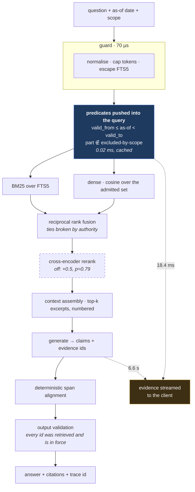
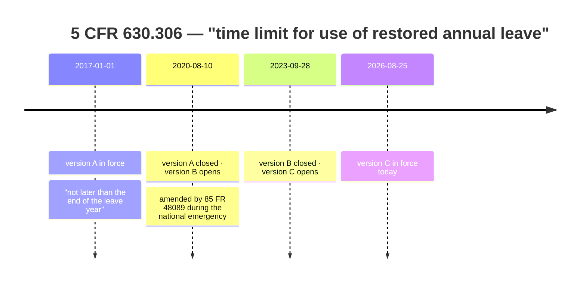

<div align="center">

# warrant

**Most RAG evaluations tell you the system was wrong. This one tells you which stage made it wrong.**

[](LICENSE)
[](pyproject.toml)
[](tests/)
[](results/eval-004-held-out.md)

</div>

---

## What is this?

A question-answering system over US federal HR regulation that answers **for a given scope, as
of a given date** — and that localizes every wrong answer to the pipeline stage responsible.

Ask *"by when must restored annual leave be scheduled?"* and the correct answer depends on
when you are asking, because the regulation changed. Ask *"how is my within-grade increase
determined?"* and it depends on whether you are paid under the General Schedule or the Federal
Wage System, because different parts of the CFR govern each.

Built on the [eCFR](https://www.ecfr.gov) versioner API, which serves the text of any part
**as it stood on any date**. Nothing is synthetic: every temporal benchmark item is grounded
in an amendment that actually happened.

## The request path



The blue box is the argument. Temporal and applicability filters are **pushed into the
query**, not applied to the results — so superseded text never consumes a candidate slot or a
rerank budget. Removing that predicate costs 96.1 points of wrong-version rate.

The dashed path is why the interface feels fast: retrieval finishes in **18.4 ms** and
generation takes **6.6 s**, so the evidence reaches the client first and the prose follows.

## Do the predicates work?

Every number below is on a **held-out test split**, split by section. Retrieval parameters
were chosen by reading the failure budget, so the budget runs on `dev` and results are
reported from `test` — the two commands default to opposite sides.

| removing | measure | delta | 95% CI | won / lost | p |
|---|---|---:|:---:|---:|---:|
| the as-of predicate | sufficiency | +2.2 | 0.0–5.5 | 5 / 0 | 0.06 |
| the as-of predicate | **wrong-version rate** | **+96.1** | 92.8–99.5 | **220 / 0** | 1.2e-66 |
| the cross-encoder | sufficiency | +1.3 | 0.0–4.0 | 4 / 1 | 0.38 |

Paired and section-clustered — 229 temporal items come from 47 sections, so items are not
independent trials and an item-level bootstrap reports an interval roughly 3.5× too narrow.

**Sufficiency alone would have called the as-of predicate useless.** With `final_k: 16`
several versions of a section fit in the result list at once, so removing the predicate barely
changes whether the right paragraph is present — it changes whether the *wrong* one is present
beside it. One measure would have dismissed the predicate on the very bucket built to prove it
works. The cross-encoder, on the same test, does nothing measurable.

## The generator

Retrieval quality and answer quality are different questions, and only the first used to be
measured. Held-out human items:

| measure | value | 95% CI |
|---|---:|:---:|
| hallucination rate | **1.5%** | 0.3–8.0 |
| citation precision | **98.5%** | 92.1–99.7 |
| answered with evidence present | 23 | correct |
| **answered with evidence absent** | **6** | **wrong — answered anyway** |
| abstained, either way | 0 | |

**The model never abstains.** A low hallucination rate only means something if the system also
declines when it should.

So abstention was built and measured — and the learned combiner **lost**. A calibrated policy
is worth shipping (74.0% coverage at 1.35% selective risk, against 4.33% for always answering;
ECE 0.033 → 0.020 after isotonic), but eight confidence features do not beat a threshold on
the single top-1 fusion score: AURC delta +0.0019, CI −0.0017 to +0.0070. Three of the eight
are constant on this corpus, and rank agreement — the feature the design expected to carry it
— ranks fifth of eight.

The aggregate is also not the number that should govern the decision. On the 29 real questions
that motivated the whole exercise the policy answers 17.2% and is still wrong on one of those;
74% is carried by the temporal and scope buckets, which are 91% of the split and far easier.
[results/eval-005](results/eval-005-abstention.md) reports all of it.

## Latency against quality

| configuration | p50 | p95 | sufficiency |
|---|---:|---:|---:|
| lexical only | **14.1 ms** | 19.3 ms | 96.7% |
| + dense | 18.4 ms | 24.2 ms | 96.7% |
| + cross-encoder | 87.4 ms | 131.1 ms | 98.3% |

Lexical-only is faster at the same quality on this bucket. A stage may be shed under load
only where this table shows it inside the noise — declaring which stages are optional without
measuring them is how a load-shedding policy trades a slow answer for a wrong one.

Two of those milliseconds were free. Lexical and dense read the same admitted set and neither
reads the other's output, so running them one after the other paid the *sum* of two latencies
for a result available at the *max* — 31.1 ms became 18.4 ms with no ranking change, because
reciprocal rank fusion does not care which list finished first. The admitted set itself was
being rebuilt per query, 9.7 ms spent recomputing an identical 9,627-element set; it is now
cached against a counter every write bumps, so a retraction invalidates it immediately.

Generation is a different order: **29.2–29.9 tokens/s** unbatched over ~205 output tokens, so
a full answer is **6.6 s** and the measured ceiling is **7.7 requests per minute** (6.7–9.4),
with a stable band at 6. The API admits under a semaphore and returns 503 with `Retry-After`.

Those three numbers replace 21.3 tok/s / 19.7 s / 3 per minute, which this README carried
until a load test re-derived them in isolation. The old throughput was measured at a token
count small enough for prefill to dominate, and the old answer length was 2× the real one —
two errors compounding in the same direction. [eval-010](results/eval-010-capacity.md) has
the derivation. Admission control also does **not** yet refuse before latency degrades: a
503's floor is 20.1 s and at 3× load its p50 is 65 s, because the real queue is the
unbounded thread pool in front of the semaphore, not the semaphore.

## Two clocks, not one



**Valid time** is when the text was the law. **System time** is when Warrant believed it was.
They are independent, and keeping both is what makes a past answer reproducible: a corrected
parse closes system time on the old row and inserts a replacement, so the row a citation
pointed at last March is still readable exactly as it was.

Ask *"by when must restored leave be scheduled?"* as of 2019 and as of 2021 and the correct
answers differ. A system with one clock has to pick one of them and be wrong about the other.

## The failure budget

Every failure attributed to the first stage at which no sufficient evidence survives — and the
ladder runs through `generation` and `grounding`, so a model failure is attributable rather
than invisible. On dev: 114 items, **1** failure, `ingestion` / `applicability` / `temporal`
all zero. It was 3 of 119 until the citation-anchor fix below; correct addresses turn out to
matter more than any ranking change measured here.


Each failure is charged to the **first** stage at which no sufficient evidence survives, and
the ladder runs all the way through generation and grounding — so a model failure is
attributable rather than invisible. Green stages carry zero failures on dev.

The instrument keeps finding its own bugs, each written up in [results/](results/): a
benchmark whose items were unsatisfiable by construction, a reranker blamed for truncation, an
intervention label that implied the wrong fix, and a chunker dropping 4.5% of the corpus that
no instrument could detect — because the gold chunks came from the same parser.

Later, and more uncomfortably: three published serving numbers wrong in the same direction
(21.3 tok/s and a 3-per-minute ceiling against a measured 29.2 and 7.7); a verifier docstring
citing 148 hand-labelled pairs from a set that existed nowhere; an optimisation that was
*slower* than doing nothing because it recomputed a constant per query; and 6.07% of citation
addresses malformed. Each was found by building the instrument that could see it, which is
the argument this repository is actually making.

## Five sources, and an authority that binds

Federal HR law is not one document. Reading only the regulation is reading the middle of an
argument, so the store holds the hierarchy and records which tier every chunk came from:

| tier | source | what it settles |
|---:|---|---|
| 1 | 5 U.S.C. (OLRC USLM) | what Congress required |
| 2 | 5 CFR (eCFR point-in-time) | how OPM implemented it |
| 3 | Federal Register notices | why it changed, and on what reasoning |
| 4 | OPM fact sheets | how OPM says it should be read |
| 5 | govinfo PDFs, incl. OCR | the printed record |

Authority is an int because retrieval sorts on it. Source and authority filters are pushed
**into** the query, not applied to the results, and fusion breaks exact ties by authority —
ties are the common case, since RRF sums a handful of reciprocals. A guidance page written for
readers tends to use the asker's own words, which is exactly what lets it outrank the law it
summarises.

### Citation addresses were wrong, not merely ugly

`890.301#ii-7-n` was the stored address of paragraph **(n)** of §890.301 — a top-level
paragraph filed under a roman numeral seven levels down. The designator stack lost its
footing at a roman run and never recovered, and **6.07% of in-force anchors were malformed**:
addresses that look checkable and are not, which is worse than a missing one.

The ambiguity is genuine and no local rule settles it. After `(h)(1)`, an `(i)` is equally
the roman opening `(h)(1)(i)` and the letter opening a top-level `(i)` — §890.301 contains
both, nine paragraphs apart. eCFR gives nothing to fall back on: across 226 snapshots,
122,273 of 122,467 in-section `<P>` elements are direct children carrying no level, path or
designator. So the decision is deferred and a beam over the section's whole designator stream
picks the cheapest reading.

| | before | after |
|---|---:|---:|
| malformed anchors (in force) | 604 (**6.07%**) | **0** |
| the drafters' own references resolving exactly | 86.9% | **89.4%** |
| unresolved | 8.5% | **4.9%** |

Measured against the cross-references the drafters wrote themselves — "paragraph (g)(3) of
this section" — which is ground truth nobody in this project authored. 810 anchors renamed;
no text changed.

### Two more that reported success while being wrong Statute
carried the OLRC *edition* date as `valid_from`, so 5 U.S.C. 6304 — in force since 1966 —
began in 2026 as far as the as-of predicate was concerned, and no dated query in the corpus
window could see it. And chunks ingested after an index build have no vector, so they are
found lexically, land in one of two fused rank lists instead of two, and quietly lose. Both
are now reported at ingest, because both failed silently:

```
reachable at floor 2017-01-01:   0/38  ->  38/38
38 believed chunks have no vector
```

## The interface

Four screens over the same API: **Ask**, **Timeline**, **Diff**, **Trace**. `make serve`
mounts them at `:8000` — the build is committed, so a clone gets a working interface with no
node toolchain.

Ask consumes `/api/ask/stream` rather than `/api/ask`, and that is the whole design argument.
Retrieval finishes in ~18 ms and generation takes ~6.6 s, so the **evidence renders the moment
it arrives** and the prose follows when it is real. Tokens are deliberately not streamed: the
model emits a JSON envelope whose partial states are half-written citations, and putting an
unresolved reference in front of a reader for several seconds is the precise failure this
project exists to detect.

Superseded text carries a stamp, because half of what this corpus holds is law that has been
repealed and a reader has to see that at a glance rather than by reading a date.

## Operations

`/metrics` is Prometheus text, hand-emitted — labels bounded by construction (a route
template, never a path), buckets chosen against measured latency rather than doubled from
5 ms. Logs are JSON carrying two ids: `request_id` groups one call including the lines
written before retrieval and after a failure, `trace_id` names a replayable artifact. A
request rejected by admission control has the first and not the second, and that asymmetry
separates *we answered wrongly* from *we never got to answer*.

`warrant eval gate` fails a build on a regression. The floor is the reference run's
section-clustered bootstrap **lower bound**, not a hand-picked threshold: sufficiency is 97.8%
with a 94.9–100 interval, so a gate at 97.8% fails half of all unchanged runs. A config-hash
mismatch reports *incomparable* rather than a pass, because a gate comparing a reranked run
against a lexical-only floor passes exactly when the system got cheaper and worse.

Guardrails are measured, not asserted. A 2,600-token repetition cost 23,004 ms and is now
refused in 0.02 ms; an unbalanced quote was a 500 and is now a 3 ms answer; a Cyrillic
homoglyph matched nothing and now matches 100 chunks. Total overhead is under 70 µs against
an 18.4 ms retrieval.

## What this is not

**It is not access control.** eCFR is published law. Nothing here is confidential, nothing can
leak, and no leak-rate claim is made. Filtering by who is asking is an *applicability*
question — citing a rule that does not govern you is a correctness failure, not a security
breach. [ARCHITECTURE.md](ARCHITECTURE.md) section 3 says this at length, because it is the
easiest thing in this project to overclaim.

Not legal advice. Not a general web-scale RAG. Every architecture section is marked
`[built]`, `[partial]` or `[designed]` so no claim has to be taken on trust.

## Run it

```bash
git clone https://github.com/tasnimuldatascience/warrant
cd warrant && make install

make fetch        # eCFR point-in-time snapshots (cached, ~10 min once)
make build        # parse into the bitemporal store
make index        # embed for dense retrieval (~10 s on a laptop GPU)
make eval         # score the held-out split, with paired ablations
make autopsy      # localize failures on dev; print the failure budget
make generation   # hallucination, citation precision, abstention
make latency      # latency vs quality per configuration
make serve        # the API on :8000

warrant eval gate            # fail if quality regressed below the recorded floor
warrant eval abstention      # risk-coverage, calibration, ECE
warrant corpus ingest --source usc     # statute, notices, guidance or scans
```

**No graphics card?** Set `index.dense.enabled: false` and `index.rerank.enabled: false`. The
lexical path, both predicates and the whole failure budget run without torch — and on this
bucket lexical-only matches the full pipeline anyway.

## How it works

Point-in-time snapshots — including the flush paragraphs and tables an earlier chunker dropped
— are ingested into a **bitemporal** SQLite store: `valid_from/valid_to` for when the text was
the law, `system_from/system_to` for when Warrant believed it was, so a past answer can be
reproduced from what was known at the time. Retrieval is BM25 over FTS5 plus dense cosine,
fused by reciprocal rank, with the as-of and applicability predicates pushed **into** the query
rather than applied to the results.

Every stage records what it saw, the score it ranked by, and how long it took. Traces persist,
so `warrant replay show` reconstructs a past request without re-running retrieval, and
`warrant replay diff` re-runs it through today's pipeline and reports the first stage that
moved. The failure budget reads those traces.

[ARCHITECTURE.md](ARCHITECTURE.md) is the full design, including what it deliberately does not
claim.

## License

MIT
